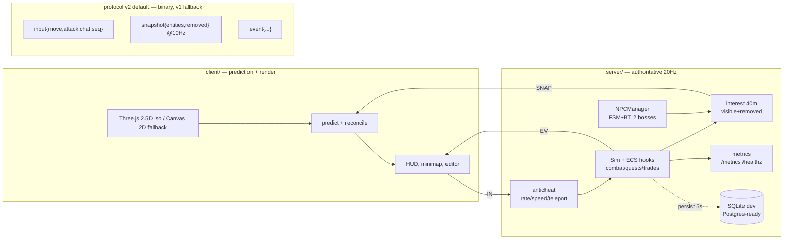
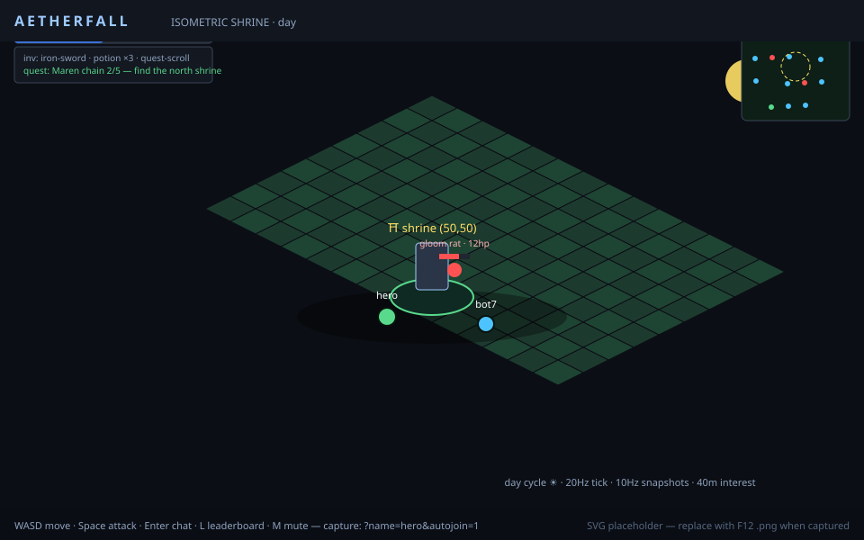
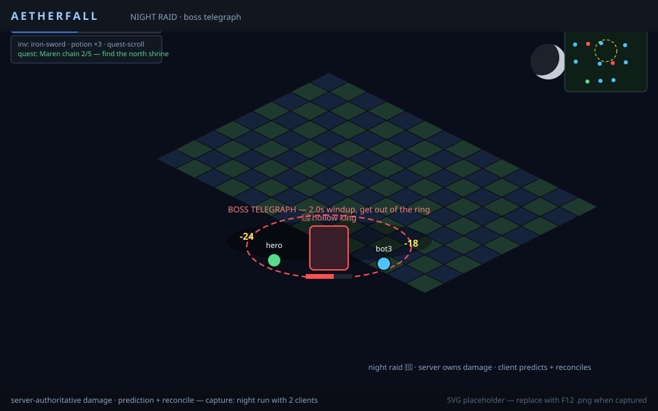
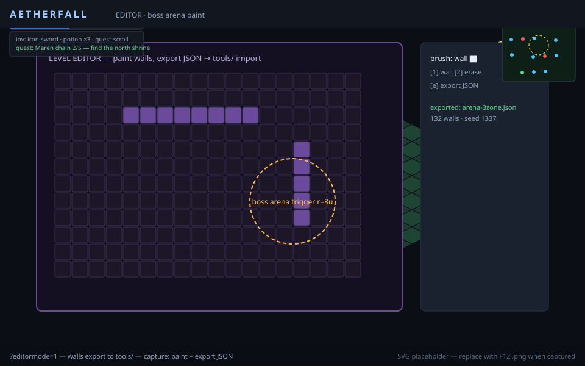
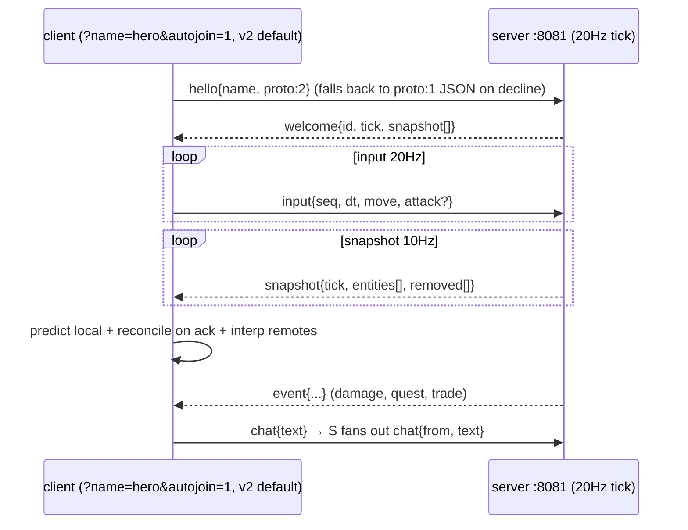

# AETHERFALL — Custom MMO Engine From Scratch


Portfolio + learning playground. No Unity/Godot/Colyseus.

## Stack (Node 22, no Docker required for dev)
- **Language:** TypeScript strict
- **Sim:** custom ECS, fixed-tick 20Hz server / 60Hz client interp, spatial hash, A*
- **Net:** authoritative WebSocket server (`ws`), binary protocol v2 (default, −95% bytes at 100 bots with v1 JSON fallback), client prediction + reconciliation, interest management, sharding stub
- **Persist:** SQLite (dev, better-sqlite3) with Postgres-ready schema, Redis optional (in-memory fallback)
- **Client:** Three.js 2.5D isometric + Canvas 2D fallback, HUD, minimap, editor
- **Tools:** headless bots (1000-ccu load test), replay viewer, level editor, benchmarks

## Layout
```
C:\aetherfall\
  shared/   protocol, types, seeded RNG, binary codec
  engine/   ECS, tick loop, spatial hash, pathfinding, world-gen
  server/   authoritative sim, auth JWT, snapshots, matchmaking/shard router
  client/   three.js renderer, prediction, HUD, minimap, editor UI
  tools/bots/  load-test bots + chaos + anti-cheat probes
  tools/replay/ replay recorder/viewer
  infra/    docker-compose (optional), prometheus config
  docs/     ARCHITECTURE.md, PROTOCOL.md, BENCHMARKS.md, ADRs
```

## Quickstart
```powershell
cd C:\aetherfall
npm install
npm run build --workspaces
npm run dev --workspace=@aetherfall/server
# in another terminal:
npm run dev --workspace=@aetherfall/client
```

## Tick / Net model
- Server ticks 20Hz, broadcasts snapshots 10Hz + deltas.
- Wire: binary protocol v2 is the default (−95% bytes at 100 bots, 0 gaps; `PROTO=1` / `?proto=1` forces v1 fallback).
- Client predicts local player, reconciles on server ack.
- Interest: 40m radius culling + chunk subscriptions.
- Anti-cheat: speed/teleport validation, input rate limit.
- Observability: zero-dep Prometheus text at `:9090/metrics` (tick ms,
  players, snapshot bytes, anticheat rejects) + `:9090/healthz`.

## Architecture



See `docs/ARCHITECTURE.md` and `docs/PROTOCOL.md`.

## Screenshots

| Isometric shrine (day) | Night raid (boss telegraph) | Editor (boss arena) |
|---|---|---|
|  |  |  |

SVG placeholders until real captures land — see `tools/capture/README.md`
(`node tools/capture/capture.mjs`, or F12 at 1280×720 → `docs/screenshots/shot-*.png`).
Benchmarks render at `tools/capture/dashboard.html` from `tools/bots/report-*.csv`.

## Hello → snapshot sequence


